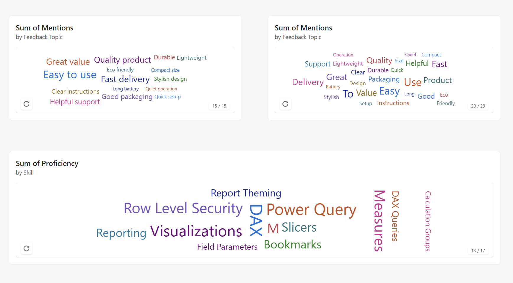

# DataZoe Word Cloud

A beautiful, modern word cloud visualization for Power BI.



## Why Use This Visual?

### Make Your Data Memorable
Transform boring lists and categories into eye-catching word clouds that instantly communicate what matters most. Large words grab attention, making it easy for report viewers to identify top performers, trending topics, or key themes at a glance.

### Match Your Brand
Choose from 9 color schemes including your report theme colors, or extract colors directly from your company logo or brand image. Your word clouds will look like they belong in your reports, not like an afterthought.

### Keep It Clean
Built with Microsoft's Fluent 2 design language, this visual looks polished and professional. Subtle shadows, smooth animations, and modern typography ensure your reports feel cohesive and up-to-date.

### Works for Everyone
Full accessibility support means all your report users can interact with the visual—keyboard navigation, screen reader support, and high contrast mode are built in, not bolted on.

### Tell a Richer Story
Add tooltips to show additional context when users hover over words. Connect your word cloud to other visuals with cross-filtering so clicking a word updates your entire report.

## Example Data

Here's sample data showing product feedback categories and their mention counts:

| Feedback Topic | Mentions | Sentiment Score |
|----------------|----------|-----------------|
| Easy to use | 847 | 4.8 |
| Fast delivery | 623 | 4.6 |
| Great value | 589 | 4.5 |
| Quality product | 534 | 4.7 |
| Helpful support | 412 | 4.4 |
| Good packaging | 387 | 4.2 |
| Clear instructions | 298 | 4.1 |
| Durable | 276 | 4.3 |
| Lightweight | 234 | 4.0 |
| Stylish design | 198 | 4.2 |
| Eco friendly | 167 | 4.5 |
| Quick setup | 145 | 4.3 |
| Compact size | 132 | 3.9 |
| Long battery | 98 | 4.1 |
| Quiet operation | 87 | 4.0 |

### DAX Table Example

Create this sample data directly in Power BI using DAX:

```dax
Feedback Data = 
SELECTCOLUMNS(
    {
        ("Easy to use", 847, 4.8),
        ("Fast delivery", 623, 4.6),
        ("Great value", 589, 4.5),
        ("Quality product", 534, 4.7),
        ("Helpful support", 412, 4.4),
        ("Good packaging", 387, 4.2),
        ("Clear instructions", 298, 4.1),
        ("Durable", 276, 4.3),
        ("Lightweight", 234, 4.0),
        ("Stylish design", 198, 4.2),
        ("Eco friendly", 167, 4.5),
        ("Quick setup", 145, 4.3),
        ("Compact size", 132, 3.9),
        ("Long battery", 98, 4.1),
        ("Quiet operation", 87, 4.0)
    },
    "Feedback Topic", [Value1],
    "Mentions", [Value2],
    "Sentiment Score", [Value3]
)
```

Then drag **Feedback Topic** to Words, **Mentions** to Values, and **Sentiment Score** to Tooltips.

---

## Example 2: Power BI Skills

Visualize Power BI skills or training topics with weighted proficiency levels:

| Skill | Proficiency | Team Members |
|-------|-------------|--------------|
| DAX | 95 | 12 |
| Data Modeling | 92 | 14 |
| Power Query | 90 | 15 |
| Visualizations | 88 | 18 |
| Measures | 86 | 16 |
| Row Level Security | 85 | 8 |
| Conditional Formatting | 82 | 14 |
| M | 80 | 10 |
| Slicers | 78 | 17 |
| Bookmarks | 75 | 10 |
| Reporting | 74 | 15 |
| Drill Through | 72 | 9 |
| Calculated Tables | 70 | 8 |
| Report Theming | 68 | 7 |
| DAX Queries | 65 | 5 |
| Field Parameters | 62 | 7 |
| Calculation Groups | 58 | 4 |

### DAX Table Example

```dax
Skills Data = 
SELECTCOLUMNS(
    {
        ("DAX", 95, 12),
        ("Data Modeling", 92, 14),
        ("Power Query", 90, 15),
        ("Visualizations", 88, 18),
        ("Measures", 86, 16),
        ("Row Level Security", 85, 8),
        ("Conditional Formatting", 82, 14),
        ("M", 80, 10),
        ("Slicers", 78, 17),
        ("Bookmarks", 75, 10),
        ("Reporting", 74, 15),
        ("Drill Through", 72, 9),
        ("Calculated Tables", 70, 8),
        ("Report Theming", 68, 7),
        ("DAX Queries", 65, 5),
        ("Field Parameters", 62, 7),
        ("Calculation Groups", 58, 4)
    },
    "Skill", [Value1],
    "Proficiency", [Value2],
    "Team Members", [Value3]
)
```

Then drag **Skill** to Words, **Proficiency** to Values, and **Team Members** to Tooltips.

---

## Data Fields

| Field | Type | Description |
|-------|------|-------------|
| Words | Category | Text field containing the words to display |
| Values | Measure | Numeric value determining word size |
| Tooltips | Measure | Additional measures to show in tooltips (up to 5) |

## Getting Started

1. Add the visual to your report
2. Drag a text/category field to the **Words** bucket
3. Drag a measure to the **Values** bucket to size words by importance
4. Customize the appearance in the format pane

## Format Options

### Text
- Minimum and maximum font sizes
- Font family selection

### Layout
- Layout type (Archimedean, Rectangular, Compact, Centered, Random scatter)
- Rotation style (Horizontal, Vertical, Mixed, Diagonal, Slight, Angled, Any angle)
- Word spacing
- Maximum words to display

#### How Word Selection Works

When your data contains more words than the **Max words** setting allows, the visual selects which words to display using this logic:

1. **Sort by value descending** – Words with the highest values appear first
2. **Take the top N** – Only the first N words (based on Max words setting) are included

| Example | Value | Included? |
|---------|-------|-----------|
| "sales" | 1500 | ✅ (rank 1) |
| "revenue" | 1200 | ✅ (rank 2) |
| ... | ... | ... |
| "misc" | 50 | ✅ (rank 300) |
| "other" | 45 | ❌ (rank 301) |

**What determines value?**
- **With a Values measure:** Uses the aggregated measure value for each word
- **Without a Values measure:** Each word counts as 1, so frequency determines ranking

The visual displays a word count label (e.g., "Showing 300 of 500 words") when words are excluded.

#### DAX Table to Demonstrate Word Selection

This table generates 500 words with descending values. With the default **Max words = 300**, only "Word_001" through "Word_300" will appear (the highest values). "Word_301" through "Word_500" will be excluded.

```dax
Word Selection Demo = 
VAR WordCount = 500
VAR Numbers = GENERATESERIES(1, WordCount, 1)
RETURN
ADDCOLUMNS(
    Numbers,
    "Word", "Word_" & FORMAT([Value], "000"),
    "Importance", WordCount - [Value] + 1
)
```

| Word | Importance | Displayed? |
|------|------------|------------|
| Word_001 | 500 | ✅ Yes (rank 1) |
| Word_002 | 499 | ✅ Yes (rank 2) |
| ... | ... | ... |
| Word_300 | 201 | ✅ Yes (rank 300) |
| Word_301 | 200 | ❌ No (exceeds max) |
| ... | ... | ... |
| Word_500 | 1 | ❌ No |

**To test:** Drag **Word** to Words and **Importance** to Values. Then adjust **Max words** in the Layout settings to see different words appear/disappear.

### Split Text
- Break phrases into individual words
- Custom delimiters
- Minimum word length filter
- Exclude specific words

### Colors
- 9 color schemes (Report theme, Fluent 2, Brand blue, Cool/Warm tones, Rainbow, Monochrome, From image, Custom)
- Extract colors from images via base64 data URI
- Define custom 5-color palettes

### Animation
- Enable/disable animations
- Animation duration
- Hover scale effect

### Plot Area Background
- Background color (supports transparent)
- Corner radius and padding
- Border styling
- Shadow effect

## Accessibility

- Full keyboard navigation (Tab, Enter, Space, Escape)
- High contrast mode support
- ARIA labels for screen readers
- Automatic color contrast adjustment

## Supported Languages

English, German, Spanish, French, Japanese, Portuguese (Brazil), Chinese (Simplified)

## Version History

### 1.0.4.0
- Improved responsive scaling - word cloud now fills the visual better when resized
- Added toggle to show/hide extracted colors

### 1.0.3.0
- Reorganized format pane (Text, Layout, Split text cards)
- Added transparent background support
- Added toggle to show/hide extracted colors
- Renamed Appearance to Plot area background

### 1.0.2.0
- Added localization support (7 languages)
- Added keyboard navigation and accessibility features
- Added context menu support
- Updated documentation

### 1.0.1.0
- Added "From image" color extraction
- Added phrase splitting and word filtering
- Added Report Theme color scheme
- Added more layout and rotation options

### 1.0.0.0
- Initial release


