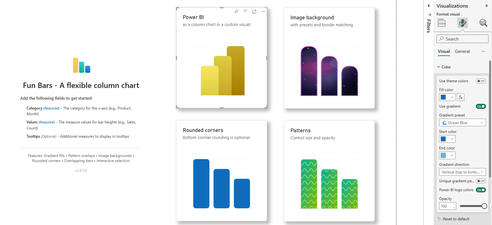

# FunBars Visual for Power BI

Visual and this doc create with Copilot for github.

A creative, highly customizable column chart visual for Microsoft Power BI that transforms ordinary bar charts into visually striking data presentations with image backgrounds, patterns, gradients, and the signature Power BI logo-style overlapping bars.

## What is FunBars?

FunBars is a custom column chart visual that goes beyond standard bar charts by offering extensive styling options. Whether you need professional business charts with subtle gradients or playful presentations with image backgrounds and patterns, FunBars delivers the flexibility to create charts that match your vision.

Key visual effects include:
- **Image Backgrounds** - Fill bars with images (packages, money, buildings, textures, and more)
- **Gradient Fills** - Apply beautiful color gradients with multiple presets
- **Pattern Overlays** - Add stripes, dots, crosshatch, and other patterns
- **Rounded Corners** - Soften bar edges for a modern look
- **Overlapping Bars** - Create the iconic Power BI logo-style stacked effect
- **Per-Bar Gradients** - Unique gradient colors for each bar

## Key Benefits

### 🎨 Creative Expression
Transform data presentations from mundane to memorable. Perfect for marketing dashboards, executive summaries, infographics, and any report where visual impact matters.

### 📊 Power BI Logo Style
Recreate the iconic Power BI logo look with overlapping bars and per-bar gradients. Great for branding materials, training presentations, and Power BI community content.

### 🖼️ Image Backgrounds
Fill bars with contextual images that reinforce your message. Show sales with money images, shipping with packages, or corporate data with building imagery.

### 🌈 Gradient Presets
Choose from 12 beautiful gradient presets including Ocean Blue, Sunset, Forest, Fire, Purple Dream, and more—or create your own custom gradients.

### ✨ Pattern Effects
Add visual texture with 8 pattern types: diagonal stripes, horizontal stripes, vertical stripes, dots, crosshatch, grid, zigzag, and waves.

### ♿ Accessibility Features
- Full keyboard navigation support
- High-contrast mode compatibility
- Screen reader friendly with ARIA attributes
- Multi-language localization

### 🎯 Enterprise Ready
- Microsoft Fluent 2 Design System compliance
- Theme color palette integration
- Conditional formatting support
- Landing page with setup instructions

## Data Fields

| Field | Required | Description |
|-------|----------|-------------|
| **Category** | ✅ Yes | Category names displayed on the X-axis |
| **Values** | ✅ Yes | Numeric measure determining bar heights |
| **Tooltips** | Optional | Additional measures to display in tooltips |

## How to Use

### Step 1: Add the Visual to Your Report
1. In Power BI Desktop, go to the **Visualizations** pane
2. Click the **...** (more options) button
3. Select **Import a visual from a file**
4. Browse to the `.pbiviz` file and click **Open**
5. The FunBars icon will appear in your visualizations pane

### Step 2: Prepare Your Data
Your data should be in a table format with at minimum:
- A column for category names
- A column for numeric values

### Step 3: Add Data to the Visual
1. Click the FunBars visual to select it
2. Drag your fields to the appropriate data wells:
   - **Category**: Your category name column
   - **Values**: Your numeric measure column
   - **Tooltips**: Additional measures for tooltip display (optional)

### Step 4: Customize Appearance
1. With the visual selected, click the **Format** pane (paint roller icon)
2. Expand the formatting cards to customize your chart

### Step 5: Interact with the Chart
- **Click** a bar to select it and cross-filter other visuals
- **Ctrl+Click** to select multiple bars
- **Right-click** for context menu options
- **Use Tab/Arrow keys** for keyboard navigation

## Example: Sales by Region

### Sample Data

| Region | Sales |
|--------|-------|
| North | 120000 |
| South | 95000 |
| East | 150000 |
| West | 88000 |
| Central | 110000 |

### Step-by-Step: Create a Gradient Bar Chart

1. **Add the FunBars visual** to your report canvas
2. **Configure the data fields:**
   - Drag `Region` to the **Category** field
   - Drag `Sales` to the **Values** field
3. **Enable gradient fills:**
   - In Format pane, expand **Color**
   - Turn on **Use gradient**
   - Select a preset like "🌊 Ocean Blue" or "🌅 Sunset"
4. **Add rounded corners:**
   - Expand **Rounded Corners**
   - Turn on **Enable rounded corners**
   - Set **Corner radius** to 15
   - Enable **Top corners only**
5. **Observe the results:**
   - Bars display with smooth gradient transitions
   - Corners are softened for a modern appearance

### Step-by-Step: Create Power BI Logo Style Bars

1. **Start with the gradient bar chart** from above
2. **Enable overlapping:**
   - Expand **Layout**
   - Turn on **Enable bar overlap**
   - Set **Overlap amount** to 40%
   - Set **Overlap direction** to "Right"
3. **Enable per-bar gradients:**
   - Expand **Color**
   - Turn on **Power BI logo colors** OR
   - Turn on **Unique gradient per bar** for custom colors
4. **Observe the results:**
   - Bars overlap like the Power BI logo
   - Each bar has a unique gradient color

### Step-by-Step: Create Image Background Bars

1. **Add the FunBars visual** to your report canvas
2. **Configure the data** as before
3. **Enable image backgrounds:**
   - Expand **Image Background**
   - Turn on **Enable Image Background**
   - Select an **Image Preset** like "💰 Money" or "📦 Packages"
4. **Add matching border:**
   - Expand **Border**
   - Turn on **Show border**
   - Enable **Auto-match to image preset** for coordinated colors
5. **Adjust transparency (optional):**
   - Set **Image opacity** to 80% for subtle effect
6. **Observe the results:**
   - Bars are filled with thematic images
   - Border color matches the image theme

## Example: Monthly Performance

### Sample Data

| Month | Revenue | Target |
|-------|---------|--------|
| Jan | 45000 | 50000 |
| Feb | 52000 | 50000 |
| Mar | 48000 | 55000 |
| Apr | 61000 | 55000 |
| May | 58000 | 60000 |
| Jun | 72000 | 60000 |

### Step-by-Step: Create a Pattern Overlay Chart

1. **Add the FunBars visual** and configure data
2. **Set base color:**
   - Expand **Color**
   - Set **Fill color** to a brand color
3. **Enable patterns:**
   - Expand **Pattern**
   - Turn on **Enable Pattern**
   - Select **Pattern Type** like "Diagonal Stripes"
   - Set **Pattern color** to white (#FFFFFF)
   - Set **Pattern opacity** to 30%
   - Adjust **Pattern size** to 8
4. **Enable data labels:**
   - Expand **Data Labels**
   - Turn on **Show data labels**
   - Set **Position** to "Outside End"
5. **Observe the results:**
   - Bars have subtle striped texture
   - Values are displayed above each bar

## Formatting Options Reference

### Color

| Setting | Description | Default |
|---------|-------------|---------|
| Use theme colors | Auto-assign colors from Power BI theme | Off |
| Fill color | Bar fill color | #0F6CBD |
| Use gradient | Enable gradient fills | Off |
| Gradient preset | Pre-defined gradient combinations | Ocean Blue |
| Start color | Custom gradient start color | #0F6CBD |
| End color | Custom gradient end color | #5EB3F0 |
| Gradient direction | Vertical, Horizontal, Diagonal, or Radial | Vertical |
| Unique gradient per bar | Different gradient for each bar | Off |
| Power BI logo colors | Use official Power BI brand colors | Off |
| Opacity | Bar transparency (0-100%) | 100% |

### Border

| Setting | Description | Default |
|---------|-------------|---------|
| Show border | Display bar border | Off |
| Color | Border color | #333333 |
| Width | Border thickness (0-10 px) | 2 |
| Auto-match to image preset | Match border to image theme | On |

### Rounded Corners

| Setting | Description | Default |
|---------|-------------|---------|
| Enable rounded corners | Apply rounded corners to bars | Off |
| Corner radius | Radius in pixels (0-50 px) | 10 |
| Top corners only | Round only top corners | On |

### Image Background

| Setting | Description | Default |
|---------|-------------|---------|
| Enable Image Background | Fill bars with images | Off |
| Image Preset | Pre-defined images (Packages, Money, Charts, etc.) | None |
| Custom image | URL or base64 data URI for custom image | (empty) |
| Image Scaling | Stretch, Fit, Fill, or Tile | Stretch |
| Image opacity | Image transparency (0-100%) | 100% |

**Available Image Presets:**
- 📦 Packages
- 💰 Money
- 📊 Charts
- 🏢 Buildings
- ⚙️ Gears
- 🔗 Network
- 🎉 Confetti
- 🔷 Geometric
- 🌊 Waves
- ⭕ Circles
- 🔺 Triangles
- ⭐ Stars
- 🌃 Starry Night
- 🌌 Galaxy
- ❤️ Hearts
- ☁️ Clouds
- 🌿 Nature
- 🎨 Abstract
- 🪵 Wood Texture
- 🪨 Marble
- 🧵 Fabric

### Pattern

| Setting | Description | Default |
|---------|-------------|---------|
| Enable Pattern | Apply pattern overlay | Off |
| Pattern Type | Diagonal/Horizontal/Vertical Stripes, Dots, etc. | Diagonal Stripes |
| Pattern color | Pattern line/dot color | #FFFFFF |
| Pattern size | Size of pattern elements (2-50 px) | 10 |
| Pattern opacity | Pattern transparency (0-100%) | 50% |

**Available Pattern Types:**
- Diagonal Stripes
- Horizontal Stripes
- Vertical Stripes
- Dots
- Crosshatch
- Grid
- Zigzag
- Waves

### Layout

| Setting | Description | Default |
|---------|-------------|---------|
| Reverse Order | Reverse category order | Off |
| Sort by Value | Sort bars by value | Off |
| Sort Descending | Sort high to low (when sorting by value) | On |
| Space between bars | Gap between bars (0-80%) | 20% |
| Bar width (%) | Relative bar width (20-100%) | 100% |
| Enable bar overlap | Create overlapping bars effect | Off |
| Overlap amount (%) | How much bars overlap (0-70%) | 30% |
| Overlap direction | Left or Right | Right |

### X-axis

| Setting | Description | Default |
|---------|-------------|---------|
| Show X-axis | Display X-axis | On |
| Show axis line | Display axis line | Off |
| Show axis label | Display axis title | Off |
| Axis label | Custom title text | (field name) |
| Color | Text color | #424242 |
| Font | Font family, size, bold, italic, underline | Segoe UI, 12pt |

### Y-axis

| Setting | Description | Default |
|---------|-------------|---------|
| Show Y-axis | Display Y-axis | On |
| Show axis line | Display axis line | Off |
| Show axis label | Display axis title | Off |
| Axis label | Custom title text | (field name) |
| Color | Text color | #424242 |
| Font | Font family, size, bold, italic, underline | Segoe UI, 12pt |
| Show gridlines | Display horizontal gridlines | On |
| Gridline color | Gridline color | #E0E0E0 |

### Data Labels

| Setting | Description | Default |
|---------|-------------|---------|
| Show data labels | Display values on bars | Off |
| Color | Label text color | #242424 |
| Font | Font family, size, bold, italic, underline | Segoe UI, 12pt |
| Position | Inside End, Outside End, or Center | Outside End |
| Display units | Auto, None, Thousands, Millions, Billions | Auto |
| Decimal places | Number of decimal places (0-5) | 0 |

## Tips and Best Practices

### Visual Design
- Use gradients sparingly for professional reports
- Image backgrounds work best for infographics and marketing materials
- Patterns at low opacity (20-40%) add texture without overwhelming
- Rounded corners give a modern, friendly appearance

### Performance
- Image backgrounds may slightly impact rendering performance
- Use built-in presets instead of custom URLs when possible
- Large datasets (1000+ bars) render best with simple styling

### Accessibility
- Ensure sufficient contrast between bar colors and backgrounds
- Use data labels for precise value communication
- Test with high-contrast mode enabled
- Avoid relying solely on color to convey meaning

### Combining Effects
- Gradient + Pattern: Use low pattern opacity (20-30%)
- Image + Border: Enable auto-match for coordinated colors
- Overlap + Gradient: Use per-bar gradients for best effect
- Rounded corners work with all fill types

## Version History

### Version 1.0.0.0

- Initial release
- Image background support with 21 presets
- Gradient fills with 12 presets
- Pattern overlays with 8 types
- Overlapping bars (Power BI logo style)
- Per-bar unique gradients
- Rounded corners
- Full formatting pane customization
- Keyboard navigation
- High-contrast mode support
- Landing page
- Context menu support
- Multi-language localization

## Support

For issues, feature requests, or questions:

- **Website**: <https://datazoepowerbi.com>
- **Email**: <zoe@datazoepowerbi.com>

## License

MIT License - See LICENSE file for details.
