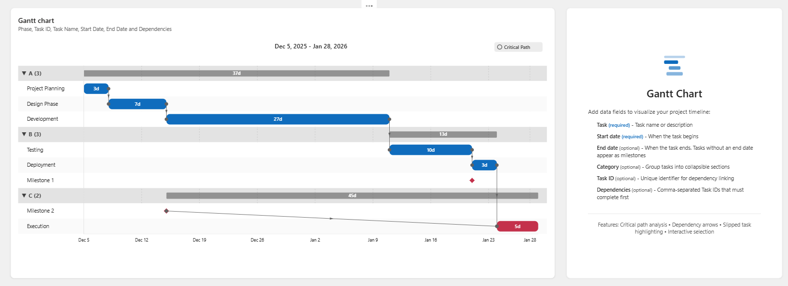
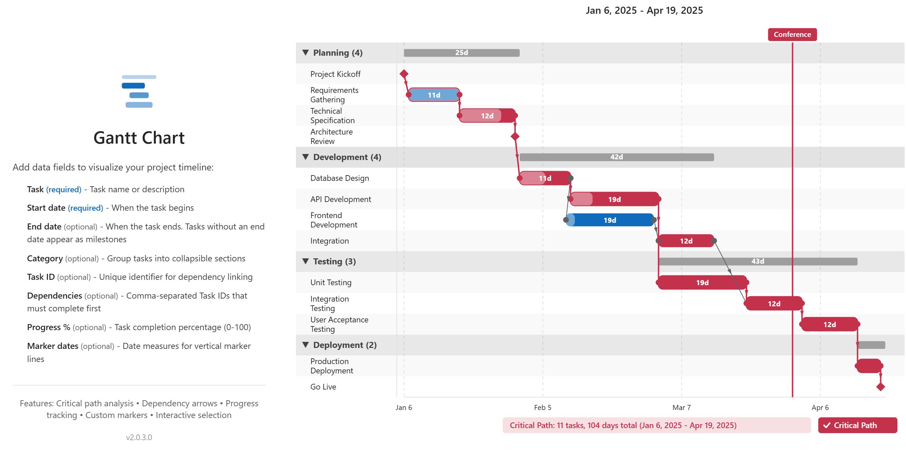

# Gantt Chart Visual for Power BI

A powerful, feature-rich Gantt chart custom visual for Microsoft Power BI that helps you visualize project timelines, track task dependencies, and identify critical paths.


This doc and the visual were created with Copilot in VS Code.

## What is a Gantt Chart?

A Gantt chart is a horizontal bar chart used in project management to visualize a project schedule. Each task is represented as a horizontal bar, with the bar's position and length indicating the task's start date, end date, and duration. Gantt charts make it easy to see:

- **What** tasks need to be completed
- **When** each task starts and ends
- **How long** each task takes
- **Which tasks** depend on others
- **Where** tasks overlap
- **The critical path** through your project





## Key Benefits

### 📊 Visual Project Timeline
See your entire project at a glance with tasks displayed on a timeline. Quickly identify scheduling conflicts, gaps, and resource allocation issues.

### 🔗 Dependency Tracking
Define task dependencies to visualize which tasks must complete before others can begin. Dependency arrows show the flow of work through your project.

### 🚨 Critical Path Analysis
Automatically identifies and highlights the critical path—the longest sequence of dependent tasks that determines the minimum project duration. Any delay on critical path tasks delays the entire project.

### ⚠️ Slipped Task Detection
Tasks that have been pushed past their original dates due to dependencies are automatically highlighted, making it easy to identify schedule impacts.

### 🎯 Milestone Support
Tasks without an end date (or with the same start and end date) are displayed as diamond-shaped milestones, perfect for marking key project deliverables.

### 📈 Progress Tracking
Add a Progress % field to show task completion as an overlay bar on each task. The progress bar fills from left to right based on the percentage (0-100).

### 📍 Custom Marker Lines
Add one or more date measures to display vertical marker lines on the chart. Perfect for deadlines, milestones, phase gates, or any significant dates. Each marker shows the measure name as a label.

### 📁 Category Grouping
Organize tasks into collapsible categories for better organization of large projects. Summary bars show the span of each category.

### ♿ Accessibility Features
- Full keyboard navigation support
- High-contrast mode compatibility
- Screen reader friendly with ARIA attributes
- Multi-language localization (English, Spanish, French, German, Portuguese)

### 🎨 Extensive Customization
- Theme color palette integration
- Customizable bar colors, borders, and opacity
- Adjustable fonts, sizes, and spacing
- Grid lines and date header formatting
- Critical path styling options

## Data Fields

| Field | Required | Description |
|-------|----------|-------------|
| **Task** | ✅ Yes | Task name or description displayed on the chart |
| **Start Date** | ✅ Yes | When the task begins |
| **End Date** | Optional | When the task ends. If empty, task appears as a milestone |
| **Category** | Optional | Groups tasks into collapsible sections |
| **Task ID** | Optional | Unique identifier for dependency linking |
| **Dependencies** | Optional | Comma-separated Task IDs that must complete first |
| **Progress %** | Optional | Task completion percentage (0-100). Displays as progress bar overlay |
| **Marker Dates** | Optional | Custom dates for vertical marker lines. Add multiple measures |
| **Tooltips** | Optional | Additional data fields to show in tooltips |

## How to Use

### Step 1: Add the Visual to Your Report
1. In Power BI Desktop, go to the **Visualizations** pane
2. Click the **...** (more options) button
3. Select **Import a visual from a file**
4. Browse to the `.pbiviz` file and click **Open**
5. The Gantt chart icon will appear in your visualizations pane

### Step 2: Prepare Your Data
Your data should be in a table format with at minimum:
- A column for task names
- A column for start dates

Optionally include:
- End dates
- Task IDs (for dependencies)
- Dependencies (referencing Task IDs)
- Categories

### Step 3: Add Data to the Visual
1. Click the Gantt chart visual to select it
2. Drag your fields to the appropriate data wells:
   - **Task**: Your task name column
   - **Start Date**: Your start date column
   - **End Date**: Your end date column (optional)
   - **Task ID**: Your unique identifier column (optional)
   - **Dependencies**: Your dependencies column (optional)
   - **Category**: Your category/phase column (optional)

### Step 4: Customize Appearance
1. With the visual selected, click the **Format** pane (paint roller icon)
2. Expand the formatting cards to customize:
   - **Task bars**: Colors, borders, opacity, height
   - **Milestones**: Shape, color, size
   - **Critical path**: Enable/disable, colors
   - **Task labels**: Font size, color
   - **Grid lines**: Show/hide, color
   - **Date header**: Font settings
   - **Categories**: Header color, expand/collapse behavior

### Step 5: Interact with the Chart
- **Click** a task to select it and cross-filter other visuals
- **Ctrl+Click** to select multiple tasks
- **Click** category headers to expand/collapse groups
- **Use the Critical Path toggle** button to show/hide the critical path
- **Right-click** for context menu options
- **Use Tab/Arrow keys** for keyboard navigation

## Example: Software Development Project

### Sample Data

Copy this data into Excel or create it in Power BI:

| TaskID | Category | Task | StartDate | EndDate | Dependencies | Progress |
|--------|----------|------|-----------|---------|--------------|----------|
| 1 | Planning | Project Kickoff | 2025-01-06 | 2025-01-06 | | 100 |
| 2 | Planning | Requirements Gathering | 2025-01-07 | 2025-01-17 | 1 | 100 |
| 3 | Planning | Technical Specification | 2025-01-13 | 2025-01-24 | 2 | 75 |
| 4 | Planning | Architecture Review | 2025-01-27 | 2025-01-27 | 3 | 0 |
| 5 | Development | Database Design | 2025-01-28 | 2025-02-07 | 4 | 50 |
| 6 | Development | API Development | 2025-02-03 | 2025-02-21 | 5 | 25 |
| 7 | Development | Frontend Development | 2025-02-10 | 2025-02-28 | 5 | 10 |
| 8 | Development | Integration | 2025-02-24 | 2025-03-07 | 6, 7 | 0 |
| 9 | Testing | Unit Testing | 2025-02-17 | 2025-03-07 | 6 | 0 |
| 10 | Testing | Integration Testing | 2025-03-10 | 2025-03-21 | 8, 9 | 0 |
| 11 | Testing | User Acceptance Testing | 2025-03-24 | 2025-04-04 | 10 | 0 |
| 12 | Deployment | Production Deployment | 2025-04-07 | 2025-04-11 | 11 | 0 |
| 13 | Deployment | Go Live | 2025-04-14 | 2025-04-14 | 12 | 0 |

### Marker Date Measures

Create these DAX measures to add milestone markers:

```dax
Project Start = DATE(2025, 1, 6)
Phase 2 Start = DATE(2025, 1, 28)
Go Live Target = DATE(2025, 4, 14)
```

### Step-by-Step Instructions

1. **Create a new Power BI report** and import the sample data above

2. **Add the Gantt visual** to your report canvas

3. **Configure the data fields:**
   - Drag `Task` to the **Task** field
   - Drag `StartDate` to the **Start Date** field
   - Drag `EndDate` to the **End Date** field
   - Drag `TaskID` to the **Task ID** field
   - Drag `Dependencies` to the **Dependencies** field
   - Drag `Category` to the **Category** field
   - Drag `Progress` to the **Progress %** field

4. **Add marker date measures:**
   - Create the DAX measures shown above
   - Drag `Project Start`, `Phase 2 Start`, and `Go Live Target` to the **Marker Dates** field
   - Each marker appears as a vertical line with its measure name as a label

5. **Observe the results:**
   - Tasks are grouped by category (Planning, Development, Testing, Deployment)
   - Milestones (Project Kickoff, Architecture Review, Go Live) appear as diamonds
   - Progress bars show completion status on each task
   - Marker lines highlight key project dates
   - Dependency arrows connect related tasks
   - The critical path is highlighted

5. **Toggle the Critical Path:**
   - Click the "Critical Path" toggle button in the chart header
   - Tasks on the critical path are highlighted with a colored border
   - The summary shows total critical path duration

6. **Explore the categories:**
   - Click the ▼ arrow next to "Development" to collapse that section
   - Click again to expand
   - Notice the summary bar showing the category's time span

## Example: Marketing Campaign

### Sample Data

| TaskID | Category | Task | StartDate | EndDate | Dependencies | Progress |
|--------|----------|------|-----------|---------|--------------|----------|
| M1 | Strategy | Campaign Brief | 2025-02-03 | 2025-02-07 | | 100 |
| M2 | Strategy | Target Audience Research | 2025-02-10 | 2025-02-14 | M1 | 100 |
| M3 | Strategy | Budget Approval | 2025-02-17 | 2025-02-17 | M2 | 100 |
| M4 | Creative | Concept Development | 2025-02-18 | 2025-02-28 | M3 | 80 |
| M5 | Creative | Copywriting | 2025-02-24 | 2025-03-07 | M4 | 60 |
| M6 | Creative | Design Assets | 2025-02-24 | 2025-03-14 | M4 | 45 |
| M7 | Creative | Video Production | 2025-03-03 | 2025-03-21 | M4 | 30 |
| M8 | Digital | Landing Page | 2025-03-10 | 2025-03-21 | M5, M6 | 15 |
| M9 | Digital | Email Templates | 2025-03-10 | 2025-03-17 | M5 | 20 |
| M10 | Digital | Social Media Setup | 2025-03-17 | 2025-03-21 | M6 | 0 |
| M11 | Launch | Soft Launch | 2025-03-24 | 2025-03-28 | M8, M9, M10, M7 | 0 |
| M12 | Launch | Full Campaign Launch | 2025-03-31 | 2025-03-31 | M11 | 0 |
| M13 | Launch | Performance Review | 2025-04-14 | 2025-04-18 | M12 | 0 |

### Key Observations

- **M3 (Budget Approval)** and **M12 (Full Campaign Launch)** are milestones
- **Creative** tasks can run in parallel after Concept Development
- The critical path likely runs through the longest creative task (Video Production)
- **Soft Launch** depends on multiple tasks completing

## Example: Construction Project

### Sample Data

| TaskID | Category | Task | StartDate | EndDate | Dependencies | Progress |
|--------|----------|------|-----------|---------|--------------|----------|
| C1 | Permits | Site Survey | 2025-03-03 | 2025-03-14 | | 100 |
| C2 | Permits | Permit Application | 2025-03-17 | 2025-03-28 | C1 | 100 |
| C3 | Permits | Permit Approved | 2025-04-14 | 2025-04-14 | C2 | 100 |
| C4 | Foundation | Excavation | 2025-04-15 | 2025-04-25 | C3 | 100 |
| C5 | Foundation | Foundation Pour | 2025-04-28 | 2025-05-02 | C4 | 100 |
| C6 | Foundation | Curing Period | 2025-05-05 | 2025-05-16 | C5 | 75 |
| C7 | Structure | Framing | 2025-05-19 | 2025-06-13 | C6 | 50 |
| C8 | Structure | Roofing | 2025-06-16 | 2025-06-27 | C7 | 20 |
| C9 | Structure | Windows & Doors | 2025-06-23 | 2025-07-03 | C7 | 10 |
| C10 | Systems | Electrical Rough-in | 2025-06-30 | 2025-07-18 | C8 | 0 |
| C11 | Systems | Plumbing Rough-in | 2025-06-30 | 2025-07-18 | C8 | 0 |
| C12 | Systems | HVAC Installation | 2025-07-07 | 2025-07-25 | C8 | 0 |
| C13 | Interior | Insulation | 2025-07-21 | 2025-07-30 | C10, C11 | 0 |
| C14 | Interior | Drywall | 2025-08-01 | 2025-08-15 | C13 | 0 |
| C15 | Interior | Painting | 2025-08-18 | 2025-08-29 | C14 | 0 |
| C16 | Interior | Flooring | 2025-09-01 | 2025-09-12 | C15 | 0 |
| C17 | Finishing | Fixtures & Appliances | 2025-09-15 | 2025-09-26 | C16, C12 | 0 |
| C18 | Finishing | Final Inspection | 2025-09-29 | 2025-09-29 | C17 | 0 |
| C19 | Finishing | Certificate of Occupancy | 2025-10-06 | 2025-10-06 | C18 | 0 |

### Key Features Demonstrated

- **Long dependency chains** show the sequential nature of construction
- **Parallel work** in the Systems phase (Electrical, Plumbing, HVAC)
- **Milestone dates** for permit approval, inspection, and certificate
- **Critical path** identifies which delays would impact completion

## Tips and Best Practices

### Data Preparation
- Use consistent date formats
- Keep Task IDs unique and simple (numbers or short codes)
- Use comma-separated values for multiple dependencies
- Leave End Date empty for milestones

### Visual Design
- Use categories to organize large projects
- Enable the color palette for automatic task coloring by category
- Adjust bar height and row spacing for readability
- Use high-contrast colors for critical path highlighting

### Interactivity
- Combine with slicers to filter by date range or category
- Use cross-filtering with other visuals for project dashboards
- Export to PDF/PowerPoint for stakeholder presentations

## Formatting Options Reference

All numeric and color options support **conditional formatting**, allowing you to set values based on data fields.

### Style Presets

| Setting | Description | Default |
|---------|-------------|---------|
| Layout preset | Quick style presets for bar height, spacing, and corner radius | Default |

Available presets:

- **Default** - Standard sizing (bar height 24px, spacing 8px, corner radius 8px)
- **Compact** - Reduced sizing for more tasks (bar height 18px, spacing 4px, corner radius 6px)
- **Very Compact** - Minimal sizing for dense views (bar height 14px, spacing 2px, corner radius 4px)
- **Spacious** - Larger sizing for presentations (bar height 32px, spacing 12px, corner radius 10px)
- **Custom** - Use your own settings

*Note: When you select a preset and then manually change bar height, spacing, or corner radius, the preset automatically switches to "Custom" to preserve your changes.*

### Task Bars

#### Color Group

| Setting | Description | Default |
|---------|-------------|---------|
| Use theme colors | Auto-assign colors from Power BI theme based on category | Off |
| Fill color | Bar fill color | #0f6cbd |
| Opacity | Bar transparency (0-100%) | 100% |

#### Border Group

| Setting | Description | Default |
|---------|-------------|---------|
| Show border | Display bar border | Off |
| Border color | Border color | #0e4775 |
| Border width | Border thickness (0-5 px) | 1 |

#### Size Group

| Setting | Description | Default |
|---------|-------------|---------|
| Bar height | Height of bars (10-50 px) | 24 |
| Corner radius | Rounded corners (0-20 px) | 8 |
| Row spacing | Space between rows (0-20 px) | 4 |

#### Duration Label Group

| Setting | Description | Default |
|---------|-------------|---------|
| Show duration | Display duration text on bars | On |
| Font | Font family, size (6-24), bold, italic, underline | Segoe UI, 11pt, Bold |
| Color | Duration text color | #ffffff |
| Auto-contrast | Automatically adjust duration label color for contrast with task bar color | On |

#### Slipped Tasks Group

| Setting | Description | Default |
|---------|-------------|---------|
| Slipped color | Color for tasks pushed by dependencies | #c4314b |

*Note: Use the Slippage toggle button at the bottom of the chart to enable/disable highlighting.*

#### Progress Group

| Setting | Description | Default |
|---------|-------------|---------|
| Show progress | Display progress bar overlay | On |
| Input format | How progress values are provided (0-100 or 0%-100%) | Whole number (0-100) |
| Color | Progress bar color | #ffffff |
| Opacity | Progress bar transparency (10-100%) | 40% |
| Bar height % | Height as percentage of task bar (20-100%) | 100% |
| Pattern | Fill pattern (Solid, Diagonal stripes, Dots, Crosshatch, Horizontal lines) | Solid |

### Milestones

| Setting | Description | Default |
|---------|-------------|---------|
| Shape | Diamond, Circle, Square, Triangle, or Star | Diamond |
| Milestone color | Fill color | #c4314b |
| Milestone size | Size in pixels (6-24 px) | 12 |

### Task Labels

| Setting | Description | Default |
|---------|-------------|---------|
| Show | Display task labels | On |
| Font | Font family, size (8-24), bold, italic, underline | Segoe UI, 12pt |
| Color | Text color | #242424 |
| Auto-contrast | Automatically adjust label color for contrast with task bar color | On |
| Max width | Maximum width in pixels (50-500 px) | 140 |
| Word wrap | Wrap long names to multiple lines | Off |
| Selection highlight color | Background color when task is selected | #ebf3fc |

### Grid Lines

#### Vertical Grid Lines Group

| Setting | Description | Default |
|---------|-------------|---------|
| Show vertical grid lines | Display vertical grid lines | On |
| Line color | Grid line color | #e0e0e0 |
| Line style | Solid, Dashed, or Dotted | Dashed |

#### Label Divider Group

| Setting | Description | Default |
|---------|-------------|---------|
| Show divider line | Vertical line separating labels from chart | On |
| Divider color | Divider line color | #e0e0e0 |
| Divider width | Divider thickness (1-5 px) | 1 |
| Divider style | Solid, Dashed, or Dotted | Solid |

#### Row Banding Group

| Setting | Description | Default |
|---------|-------------|---------|
| Show row banding | Display alternating row colors | On |
| Even row color | Background color for even rows | #ffffff |
| Odd row color | Background color for odd rows | #f9f9f9 |

#### Day Shading Group

| Setting | Description | Default |
|---------|-------------|---------|
| Shade weekends | Highlight Saturday and Sunday | Off |
| Shade specific days | Comma-separated day names (e.g., Monday, Friday) | (empty) |
| Shade color | Background color for shaded days | #f0f0f0 |
| Shade opacity | Transparency (10-100%) | 30% |

### Date Header

| Setting | Description | Default |
|---------|-------------|---------|
| Show | Display date header | On |
| Font | Font family, size (10-24), bold, italic, underline | Segoe UI, 14pt |
| Color | Text color | #242424 |

### Dependency Lines

| Setting | Description | Default |
|---------|-------------|---------|
| Show | Display dependency arrows | On |
| Line color | Dependency line color | #616161 |
| Line width | Line thickness (1-5 px) | 1 |
| Line style | Solid, Dashed, or Dotted | Solid |
| Path style | Curved, Straight (elbow), or Straight down | Straight down |
| Arrow size | Size of arrowhead (4-16 px) | 8 |

### Critical Path

| Setting | Description | Default |
|---------|-------------|---------|
| Border color | Highlight border color | #c4314b |
| Border width | Highlight border thickness (1-6 px) | 2 |
| Show duration summary | Display critical path stats | On |

*Note: Use the Critical Path toggle button at the bottom of the chart to enable/disable highlighting.*

### Categories

| Setting | Description | Default |
|---------|-------------|---------|
| Show | Display category groupings | On |
| Header font | Font family, size (10-24), bold, italic, underline | Segoe UI, 13pt, Bold |
| Header color | Category header text color | #424242 |
| Start expanded | Categories expanded by default | On |

### Today Line

| Setting | Description | Default |
|---------|-------------|---------|
| Show | Display today marker line | On |
| Line color | Marker line color | #c4314b |
| Line width | Line thickness (1-6 px) | 2 |
| Line style | Solid, Dashed, or Dotted | Solid |
| Show label | Display label above line | On |
| Label text | Text to display | Today |
| Day offset | Shift marker by days (-365 to 365) | 0 |

## Version History

### Version 2.2.0.0

- Added auto-contrast for duration labels (automatically adjusts text color based on bar color for better visibility)
- Added category summary bar tooltip showing task count, start/end dates, and total duration
- Added tooltip headers to distinguish between Task, Milestone, and Category Summary tooltips
- Added hover tooltips on task labels and category labels to show full names (useful for truncated text)
- Simplified style preset logic for more stable rendering during resize and toggle interactions
- Fixed preset switching issue when using on-visual toggles (Critical Path, Slippage)
- Removed auto-contrast from task labels (labels are on row background, not bars)
- Various stability improvements

### Version 2.1.0.0

- Added style presets (Default, Compact, Very Compact, Spacious, Custom)
- Added slippage toggle button with summary display
- Added progress format option (whole number vs percentage)
- Added conditional formatting support for all numeric and color options
- Updated localization for all new features

### Version 2.0.2.0

- Added Progress % field for task completion tracking
- Added Marker Dates field for custom vertical marker lines (supports multiple measures)
- Added Today Line with configurable offset, style, and label
- Added task label max width and word wrap options
- Improved label truncation with configurable width

### Version 2.0.0.0

- Added localization support (EN, ES, FR, DE, PT-BR)
- Added rendering events for certification
- Added multi-visual selection support
- Added keyboard navigation
- Added high-contrast mode support
- Added landing page
- Added context menu support
- Added critical path toggle button
- Enhanced accessibility features

### Version 1.0.0.0

- Initial release
- Basic Gantt chart functionality
- Dependency arrows
- Critical path calculation
- Category grouping
- Milestone support

## Support

This is offered as-is and without warranty. For issues, feature requests, or questions:

- **Website**: <https://datazoepowerbi.com>
- **Email**: <zoe@datazoepowerbi.com>

## License

MIT License - See LICENSE file for details.

